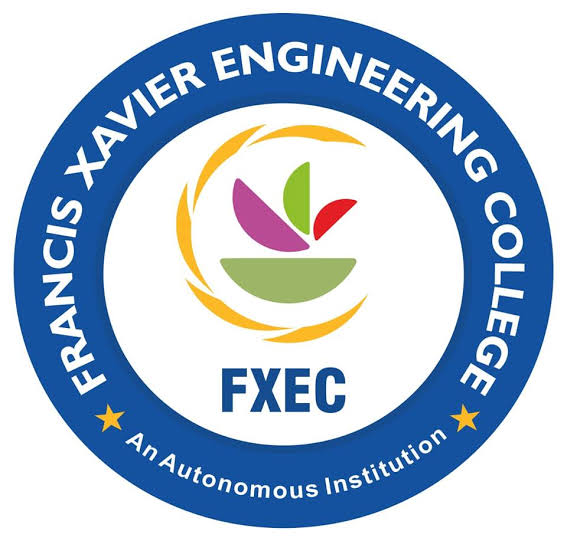
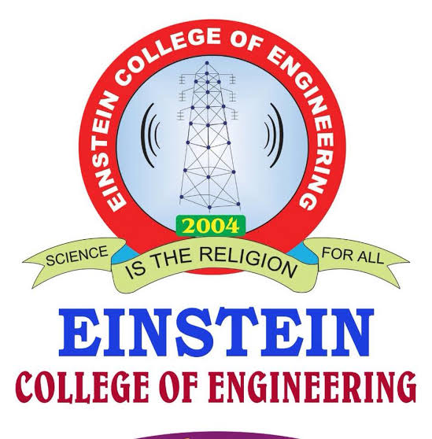
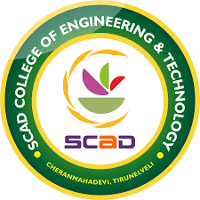
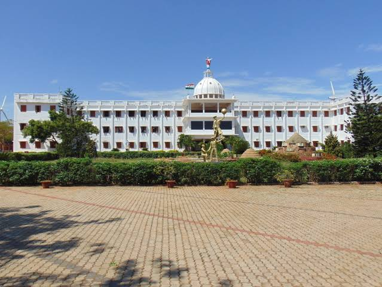
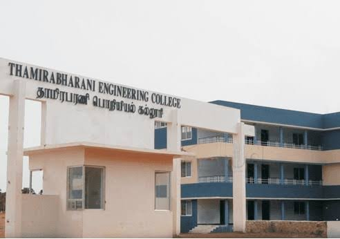
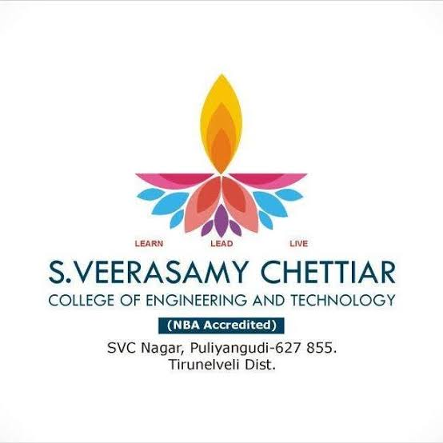

<!DOCTYPE html>
<html>
<head>
<title>TOP 10 COLLEGES IN TIRUNELVELI</title>
    
    </head>
<body>
    <h1 style="text-align:center" "color:red"><mark>TOP 10 ENGINEERING COLLEGES BASED ON RATINGS</mark></h1>
    <marquee bgcolor="white" direction="left"> IF YOU WANT TO KNOW ABOUT THE COLLEGE INFORMATION, CLICK THE LOGO OF COLLEGE 
    </marquee>
    <h4><u>1.FRANCIS XAVIER COLLEGE OF ENGINEERING</u></h4>

    <h4><u>2.ANNA UNIVERSITY OF TECHNOLOGY</u></h4>
    
    <h4><u>3.CAPE INSTITUTE OF TECHNOLOGY</u></h4>

    <h4><u>4.EINSTEIN COLLEGE OF ENGINEERING</u></h4>
    
    <h4><u>5.PET ENGINEERING COLLEGE</u></h4>

    <h4><u>6.VV COLLEGE OF ENGINEERING</u></h4>
    
    <h4><u>7.SCAD COLLEGE OF ENGINEERING AND TECHNOLOGY</u></h4>
<a href="https://collegedunia.com/college/14812-scad-college-of-engineering-and-technology-scad-cet-tirunelveli">
    
    <h4><u>8.SARDAR RAJA ENGINEERING COLLEGE</u></h4>
    
    <h4><u>9.THAMIRABHARANI ENGINEERING COLLEGE</u></h4>

    <h4><u>10.S.VEERASAMY CHETTIAR COLLEGE OG ENGINEERING AND TECHNOLOGY</u></h4>
    
    </body>
</html>
                                                             
